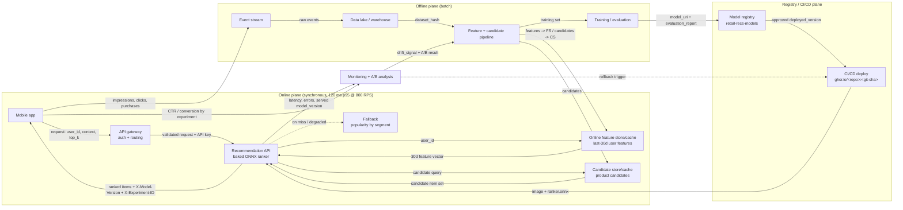

# Architecture — Retail Recommendations (Scenario X)

The system has two planes. The **online plane** answers home-screen requests synchronously inside the 120 ms p95 budget. The **offline plane** plus the **registry/CI/CD plane** produce candidates, features, and the ranking model that the online plane consumes. A monitoring and A/B loop closes feedback from production back into the offline plane.

## Online path (request flow)

Mobile app → API gateway → recommendation API → online feature store → candidate store → ranking model → recommendations response. The ranker is **baked into the image**; candidates and user features are **fetched from stores/caches** (not baked). On a cache miss or store degradation the API serves the **fallback** (popularity-by-segment) so cold-start users and degraded mode still get reasonable results.

## Offline path (production flow)

Event stream → data lake/warehouse → feature + candidate pipeline → training/evaluation → model registry → deployment. The pipeline writes user features to the online feature store and candidate sets to the candidate store; training produces a `model_uri` and `evaluation_report` that land in the registry.

## Boundaries

- **Online plane**: latency-critical, stateless replicas, must stay inside 120 ms p95.
- **Offline plane**: throughput-oriented batch, no latency SLO.
- **Registry/CI/CD plane**: source of truth for the approved model version and the image that ships it.

## Feedback loop

Monitoring collects latency, errors, and the **served `model_version`**; the app reports CTR/conversion tagged by experiment. The A/B analysis and drift detection feed the offline pipeline (retraining) and can fire a **rollback trigger** into CI/CD when guardrails break (see [`monitoring/alerts.yaml`](../monitoring/alerts.yaml) and [`runbooks/rollback.md`](../runbooks/rollback.md)).
