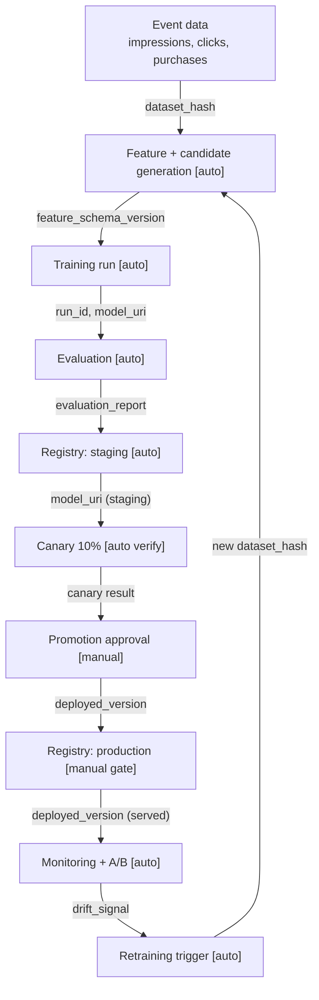

# Model lifecycle — home-screen-ranker

End-to-end flow from raw events to production and back into retraining. Artifacts are named on the arrows so lineage is traceable from a served response to the dataset and run that produced it. Steps are marked **[auto]** (pipeline-driven) or **[manual]** (human approval).

## Notes

- **Automatic:** feature/candidate generation, training, evaluation, staging registration, and canary verification all run from the pipeline on a schedule or on a retraining trigger.
- **Manual:** promotion from `staging` → `production` requires sign-off from ML Lead, Product Owner, and Platform Owner (see [`model-registry.yaml`](model-registry.yaml)).
- **Lineage:** every registered version carries `git_sha`, `dataset_hash`, `feature_schema_version`, `training_image_digest`, `run_id`, `random_seed`, `model_uri`, and `evaluation_report_uri`, so a served `X-Model-Version` traces back to the exact data and code.
- **Feedback:** `drift_signal` (data/score drift) and A/B regressions trigger retraining; a production guardrail breach triggers rollback to the previous successful production version (see [`runbooks/rollback.md`](../runbooks/rollback.md)).
